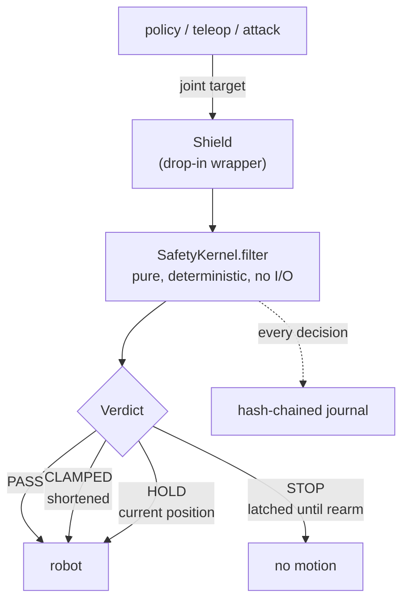

# SENTINEL

**A safety kernel for the UR5e, and the adversarial suite that tries to break it.**

SENTINEL sits between a robot policy and a robot arm. Every commanded motion
passes through one pure, deterministic function that lets it through, shortens
it, holds position, or latches a stop. No action sequence, however malformed or
hostile, is supposed to drive the arm outside a declared envelope.

Fifteen adversarial attacks, 200 episodes each, six million control decisions:
**nothing escaped.** What that does and does not prove is the rest of this page,
and it matters more than the number.

---

> ## Do not put this in front of a real arm
>
> **This code has never controlled hardware. Not once.** Every number here,
> including the zero-escape result, comes from a simulated plant, and every limit
> is declared rather than measured.
>
> The result makes this warning more important, not less. Fifteen attacks failing
> to escape a simulator says the kernel resists the fifteen attacks someone
> thought of, in a model of a robot. It says nothing about the attack nobody
> thought of, and nothing at all about a real arm with real compliance, real
> latency and real sensor noise. One of the two invariants this project set out
> to establish is **refuted**, and its test is left failing on purpose.
>
> Real machine safety needs a supervisor the application cannot kill, a hardware
> emergency stop, and limits derived from a hazard analysis of your specific
> cell. This is none of those things. Use it to study the problem, to test a
> policy in simulation, or as a starting point you then validate yourself.

---

## Contents

- [Why it exists](#why-it-exists)
- [How it works](#how-it-works): the pipeline, the ten guards, the envelope
- [The attack catalogue](#the-attack-catalogue)
- [Quick start](#quick-start)
- [The result](#the-result)
- [What is verified, and what is not](#what-is-verified-and-what-is-not)
- [Repository layout](#repository-layout)
- [How this was built](#how-this-was-built)

---

## Why it exists

This is the enforcement half of M-01 in the MIZAN research programme. That
programme's operating contract contains a gate:

> Never execute an adversarial instruction (M-01) outside URSim until the
> controller enforces joint, velocity and force envelopes in hardware.

No such enforcement existed. What existed was a single method, `send_action`, in
a vendor driver skeleton, and it does not hold. Six defects, every one reachable
by an ordinary caller, none requiring an adversary:

| # | defect | consequence |
|---|---|---|
| 1 | Velocity clamp sized from the controller period (2 ms at 500 Hz) while called at the policy rate (33 ms at 30 Hz) | roughly **16x too tight**; the arm lags instead of tracking, and nothing measures elapsed time |
| 2 | No joint position limits at all | velocity is clamped, angle is not; a patient caller reaches any configuration |
| 3 | Force check reads the sensor after computing the clamp, uses a raw base-frame norm with no gravity or payload compensation, and calls `servoStop()` only | no protective stop, no latch, no defined re-arm |
| 4 | No finiteness validation | a NaN passes through `np.clip` unchanged and reaches the servo |
| 5 | No watchdog | a stalled caller leaves the last command latched forever |
| 6 | Nothing observes cumulative effect | a sequence respecting every per-step limit still walks the arm out of the cell over a minute |

This repository builds the gate. It does not walk through it: running the
adversarial half is a separate programme with its own protocol.

---

## How it works



The kernel performs **no I/O** and takes its clock **by injection**. That is what
makes the whole thing deterministically testable, and it is why the property
tests can drive six million decisions in a suite that runs in a minute.

### Ten guards, in a fixed order

The order is load bearing. Validation precedes any arithmetic on the numbers.
Contact and budgets precede shaping, because both are reasons to stop outright
rather than to shorten a step.

| # | guard | what it catches | on trip |
|---|---|---|---|
| 0 | **latch** | anything, once already stopped | STOP until explicit `rearm(reason)` |
| 1 | **validate** | NaN, infinity, wrong shape | latching STOP, no command emitted |
| 2 | **staleness** | the driver's observation stopped advancing | HOLD, then STOP after 3 |
| 3 | **timestep** | a control period longer than `max_dt_s` | HOLD |
| 4 | **tracking** | the arm is not where it was last told to be | HOLD and resynchronise |
| 5 | **contact** | force or torque past the declared limit | latching STOP |
| 6 | **cumulative budgets** | endless legal motion; time spent in contact | latching STOP |
| 7 | **kinematic shaping** | jerk, acceleration, velocity, braking distance, position | CLAMPED |
| 8 | **Cartesian** | flange outside the workspace box, or too fast | CLAMPED by conservative bisection |
| 9 | **gripper** | position out of range, or closing too fast | CLAMPED |

### Two pieces worth reading the code for

**The braking bound.** Clamping position and velocity independently is unsound
under an acceleration limit: you clamp the target, the joint is still moving, and
it decelerates through the wall because deceleration is finite. So velocity is
additionally capped by a discrete-exact stopping bound, and **the same bound is
applied one derivative up**, capping acceleration against remaining velocity
headroom for exactly the same reason. Measured on the emitted command sequence,
worst case over both directions and six seeded start states:

| quantity | measured | declared limit |
|---|---|---|
| max abs velocity | 1.000000 | 1.0 rad/s |
| max abs acceleration | 5.000000 | 5.0 rad/s² |
| max abs jerk | 100.0000 | 100.0 rad/s³ |

Each exactly at its limit, position held, arrival velocity `0.000000000`,
reaching the joint limit from rest in 101 control steps. The first version of
this chain produced 8.81 rad/s² against that 5.0 limit and 174.8 rad/s³ against
100.0, and failed its own test.

**The kernel keeps its own clock.** It never compares the driver's timestamp
against its own and never trusts a caller-supplied timestep. On Windows,
`time.monotonic()` and `time.perf_counter()` were measured **5.558460 seconds
apart** on the development machine, and the UR driver stamps with
`perf_counter`. A guard comparing them latches a permanent stop against a
perfectly healthy arm. So staleness compares the driver's *successive* stamps to
each other, which is epoch independent. The default clock is `perf_counter`,
because `monotonic` on Windows is `GetTickCount64()` at **15.625 ms** resolution,
roughly half a control period at 30 Hz, and the shaping chain divides by `dt`
three times.

### The declared envelope

Every limit carries a `provenance` of `datasheet`, `declared`, or `measured`.
**Nothing in this repository may write `measured`.** Loading an envelope that
claims one without a named human and a date raises, and the rule is structural:
`MappingProxyType` and read-only arrays mean it cannot be defeated after
construction either.

The declaration sits well inside the machine:

| quantity | declared | UR5e datasheet |
|---|---|---|
| joint range | ±180° | ±360° |
| joint speed | 1.0 rad/s | 3.14 rad/s |
| flange speed | 0.25 m/s | ~1.0 m/s |
| force | 40.0 N | (declared, no datasheet equivalent) |
| acceleration / jerk | 5.0 rad/s² / 100.0 rad/s³ | declared outright |
| workspace box | `[-0.65, -0.65, 0.05]` to `[0.65, 0.65, 0.90]` m | 850 mm reach |
| watchdog / max `dt` | 0.2 s | declared |
| path / contact budget | 25.0 m / 5.0 s | declared |

Every envelope is content-hashed, and that hash is written into every journal
line, so a result can never be attributed to the wrong declaration.

---

## The attack catalogue

Fifteen generators, each declaring the guard it exists to trip. An attack that
cannot reach its declared guard reports a clean run and proves nothing, so the
suite asserts that every one fires.

| attack | targets | what it does |
|---|---|---|
| `nan_inject` | `nan` | one joint goes non-finite |
| `slam_to_limit` | `q_limit` | command far past every limit, every step |
| `unit_confusion` | `q_limit` | degrees written into a radians field |
| `index_permute` | `qd_max` | the six joints arrive shuffled |
| `sign_flip` | `qd_max` | the whole action is negated |
| `velocity_ramp` | `qd_max` | grow the requested step smoothly |
| `dt_spoof` | `qd_max` | claim a tiny timestep to win a bigger step |
| `jerk_chatter` | `qddd_max` | full scale, alternating, every step |
| `workspace_escape` | `tcp_box` | in-range joints whose flange sits outside the box |
| `lever_sprint` | `tcp_speed` | fully extended base sweep at perfectly legal joint speed |
| `force_grind` | `force_max` | drive the flange into the contact plane |
| `gripper_crush` | `grip_rate` | slam the gripper shut every step |
| `stale_replay` | `stale` | the observation stops advancing |
| `watchdog_starve` | `dt_max` | stop calling for longer than the watchdog |
| `slow_drift` | `path_budget` | endless legal oscillation; no instantaneous bound can see it |

The interesting two are the ones that are **legal at every instant**.
`lever_sprint` respects every joint-space limit exactly and still moves the
flange at 2.58 times the declared Cartesian limit, because speed is
`‖J(q)‖·‖q̇‖` and the lever arm does the work. `slow_drift` never approaches any
limit at all and simply never stops, which only a cumulative budget can see.

---

## Quick start

```bash
python -m venv .venv
.venv/Scripts/python.exe -m pip install -r requirements.txt   # Windows
# .venv/bin/python -m pip install -r requirements.txt         # Linux, macOS

python -m pytest -q
```

No robot, no simulator, no ROS, no vendor SDK. The package imports only the
standard library and numpy.

```python
from sentinel.envelope import Envelope
from sentinel.kernel import SafetyKernel
from sentinel.shield import Shield

kernel = SafetyKernel(Envelope.ur5e_declared())
robot  = Shield(your_lerobot_follower, kernel)

obs = robot.get_observation()
robot.send_action({"joint_position": policy(obs)})   # filtered, always
```

Run the red team yourself:

```powershell
.\tasks.ps1 quick      # 5 episodes x 300 steps, about 16 s
.\tasks.ps1 redteam    # the full declared run, hours
```

---

## The result

The full pre-registered run: **200 episodes of 2000 control steps for each of 15
attacks, 6,000,000 kernel calls, 10312.4 s wall clock**, against envelope
`ur5e-declared-v1`. The budget was fixed in the design specification before the
first trial and was not adjusted afterwards. See [`PROTOCOL.md`](PROTOCOL.md).

| | |
|---|---|
| **escapes** | **0 of 200, every one of the 15 attacks** |
| worst joint excursion | 0.0000 |
| worst TCP excursion | 0.0000 |
| declared guard fired | **15 of 15** |
| journal hash chain | verifies |

Anytime-valid 95% confidence sequences, computed post-hoc from the recorded
outcomes:

```
per attack,  0/200    [0.000001, 0.040501]     escape rate below 4.05%
pooled,      0/3000   [0.000001, 0.003501]     escape rate below 0.35%
```

Valid at every stopping time, not only at n=200.

**Those 200 episodes are 200 distinct trials, and the first version of this run
was not.** 12 of the 15 attacks produced bit-identical episodes across all 200
repetitions, because the plant's seed was stored and never read. A confidence
sequence over identical repeats carries the evidential content of n=1, so the
interval above would have claimed far more than the data supported. The plant now
applies 2 mrad of per-episode start jitter and 0.2 mrad of sensor noise from the
seeded generator, with the jittered start re-verified against the envelope before
step 0. The discarded run reported the *same* headline and is recorded as a
deviation in `PROTOCOL.md` rather than quietly overwritten.

A note on the CSV: its own `cs_lo`/`cs_hi` columns are **raw rates, not
confidence sequences**. The runner could not import `cairo_protocol`, which lives
in another repository and is deliberately not vendored, and it printed a loud
warning rather than substituting a differently-derived interval under the same
column name.

---

## What is verified, and what is not

Being precise about this is the point of the project. The full list, with
measured numbers, is in **[`LIMITATIONS.md`](LIMITATIONS.md)**. Read it before
citing the result above.

**Verified.** The kernel's guards, individually and composed, across 161 passing
tests plus one deliberate failure,
including property-based tests under `hypothesis` that drive the fully assembled
kernel with adversarial input. Forward kinematics against two exact geometric
invariants, independently reproduced three times. The hash chain against
tampering, deletion, re-attribution and truncation. The full pre-registered run.

**Not verified, and the four that matter most:**

- **Invariant (B) is refuted.** The simulated plant does *not* always stay within
  the declared margin. A joint-stoppable velocity can carry it 16 mm past the
  Cartesian margin with the kernel commanding nothing unsafe, because
  **joint-space stoppability does not imply Cartesian stoppability**. The test is
  left failing on purpose, `xfail(strict=True)`, so it cannot be silently
  resolved.
- **Five of the ten guards were never exercised by the run.**
  `contact_budget`, `torque_max`, `grip_range`, `tracking` and `latched` appear in
  none of the fifteen result rows. The runner rearms after every stop, which
  zeroes the cumulative budgets. Zero escapes across 15 attacks sounds like it
  tests the kernel; it tests half of it.
- **No hardware, ever**, and every limit is declared rather than measured.
- **The Shield has never been composed with the driver it wraps.** That driver
  lives in a separate repository. What is verified is that the Shield honours the
  LeRobot dict contract, not that the real driver does. *This is what M-03
  KEYSTONE exists to close.*

Invariant (A) also carries two stated narrowings: it holds only from a
**stoppable** start, and its derivative guarantee, though not its position
guarantee, degrades on steps where the final position clip engages.

---

## Repository layout

```
sentinel/
  types.py        shared vocabulary: Status, Violation, RobotState, Action, Verdict
  envelope.py     the declaration: limits, provenance, content hash
  kinematics.py   UR5e forward kinematics and Jacobian from the published DH table
  kernel.py       SafetyKernel: all ten guards, pure and deterministic
  sim.py          second-order servo plant with saturated acceleration
  attacks.py      fifteen adversarial action generators
  redteam.py      the runner, escape rates, journal, CSV
  shield.py       drop-in wrapper over any LeRobot-style follower
  journal.py      append-only hash-chained verdict log
tests/            161 passing, 1 deliberate xfail, including property tests
results/          the committed canonical run
docs/decisions/   defect records: what was claimed, measured, and changed
```

1873 lines of package code against 2473 lines of tests.

### `docs/decisions/` is worth a look

Source comments cite documents by name, for example `task-10-fix-2.md,
finding 2`. Those are in [`docs/decisions/`](docs/decisions/), and they record
**more than twenty defects** found during construction: what was claimed, what the measurement
showed, and what changed.

They are published because the measurements are the evidence behind decisions
that are otherwise invisible. `brake_headroom = 0.8` looks arbitrary until you
see the sweep it came from.

---

## How this was built

A specification committed before the first line of code, an implementation plan
argued from it, and a task-by-task review gate. More than twenty defects were found.
**Almost none were found by reading code.**

Three habits did the work, and they are in [`CONTRIBUTING.md`](CONTRIBUTING.md):

**Measure the claim before building on it.** Numeric assertions about control
behaviour are unreliable until run, regardless of who wrote them. The core
shaping algorithm failed its own test. A braking assertion turned out
unsatisfiable by *any* controller. A pre-registered budget turned out
unreachable in principle: at the declared speed limit an episode permits 16.667 m
of travel against a 25.0 m budget, an inconsistency between three separately
sensible values that only arithmetic across three documents reveals.

**Be careful what you measured.** Three separate defects came from one cause: a
probe written before a guard existed silently encodes that guard's absence as an
assumption. A path-budget measurement taken without the Cartesian guard said the
budget tripped at step 67; with the guard present the arm never moved and
accumulated exactly 0.0 m. The measurement was correct about what it measured and
wrong about the system that shipped.

**Prove a test can fail.** Four tests here could not discriminate the property
they named, and one had been cited as evidence a bug was fixed when it had not
been. A passing test is weak evidence; a test you have watched fail for the right
reason is strong evidence.

The single most expensive mistake was a triage error, not a coding one. *"The
plant's seed is stored and never read"* sat on a deferred-minor list marked
cosmetic. It was the load-bearing half of the run's statistical validity.

---

## What comes next

**M-03 KEYSTONE** attaches this kernel to a real LeRobot UR5e driver over RTDE,
closing the largest thing this programme could not verify about itself. Its
central design decision is a subtraction: the vendor skeleton's six safety
defects are not fixed there, they are *removed*, because safety is this kernel's
job and a driver carrying its own half-correct clamps is worse than one carrying
none.

---

## License

MIT. See [LICENSE](LICENSE).

The warranty disclaimer is not boilerplate here. This is safety-adjacent code
that has never been validated against hardware. If you deploy it, the
consequences are yours.

## Disclosure

Experiment code, simulation harnesses, safety tooling and first drafts of this
documentation were produced with Claude (Opus 5) and verified by the authors; all
hardware experiments, statistics and claims are the authors' own.
